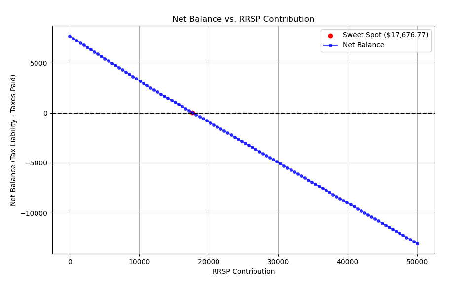

# rrsp-optimizer

Simple RRSP contribution optimizer built in Python for my personal finances.

Based on inputs such as taxable income and taxes paid the script will provide the optimal contribution amouts to obtain a Net Zero tax return.

### How to run

- (1) Simply edit the `config.yaml` to set the inputs and tax brackets
- (2) Run with `python3 rrsp_optimizer.py`

Use at your own risk. Not Financial Advice.


## Example

```
$ cat ./config.yaml 
default_inputs:
  income: #income  
  taxes_paid: #taxes_paid
  investment_profits: #investment_profits 
  rrsp_room: #rrsp_room_from_previous_year
  medical_expenses: #medical_expenses 
  is_quebec: true #quebecois or not

# min, max, rate
federal_brackets:
  - [0, 53359, 0.15]
  - [53359, 106717, 0.205]
  - [106717, 165430, 0.26]
  - [165430, 235675, 0.29]
  - [235675, null, 0.33]

# min, max, rate
quebec_brackets:
  - [0, 46395, 0.15]
  - [46395, 92790, 0.20]
  - [92790, 112655, 0.24]
  - [112655, null, 0.2575]
```

```
$ python rrsp_optimizer.py
--- RRSP Contribution Analysis ---
Contribution    Taxable Income    Total Tax Liability    Tax Savings    Net Balance
--------------  ----------------  ---------------------  -------------  -------------
$0.00           $105,000.00       $37,678.90             $0.00          $7,678.90
$2,631.58       $102,368.42       $36,507.85             $1,171.05      $6,507.85
$5,263.16       $99,736.84        $35,336.80             $2,342.11      $5,336.80
$7,894.74       $97,105.26        $34,165.75             $3,513.16      $4,165.75
$10,526.32      $94,473.68        $32,994.69             $4,684.21      $2,994.69
$13,157.89      $91,842.11        $31,861.56             $5,817.35      $1,861.56
$15,789.47      $89,210.53        $30,795.77             $6,883.14      $795.77
$18,421.05      $86,578.95        $29,729.98             $7,948.93      $-270.02
$21,052.63      $83,947.37        $28,664.19             $9,014.72      $-1,335.81
$23,684.21      $81,315.79        $27,598.40             $10,080.51     $-2,401.60
$26,315.79      $78,684.21        $26,532.61             $11,146.29     $-3,467.39
$28,947.37      $76,052.63        $25,466.82             $12,212.08     $-4,533.18
$31,578.95      $73,421.05        $24,401.03             $13,277.87     $-5,598.97
$34,210.53      $70,789.47        $23,335.24             $14,343.66     $-6,664.76
$36,842.11      $68,157.89        $22,269.45             $15,409.45     $-7,730.55
$39,473.68      $65,526.32        $21,203.66             $16,475.24     $-8,796.34
$42,105.26      $62,894.74        $20,137.87             $17,541.03     $-9,862.13
$44,736.84      $60,263.16        $19,072.08             $18,606.82     $-10,927.92
$47,368.42      $57,631.58        $18,006.29             $19,672.61     $-11,993.71
$50,000.00      $55,000.00        $16,940.50             $20,738.40     $-13,059.50
```

